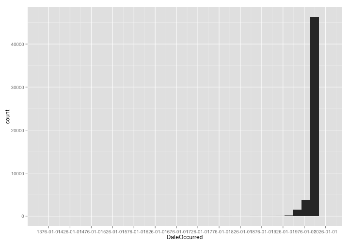
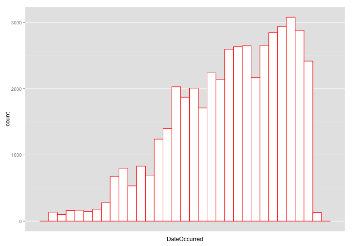
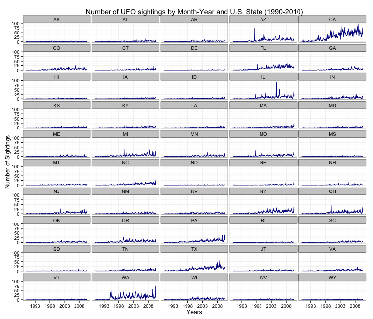
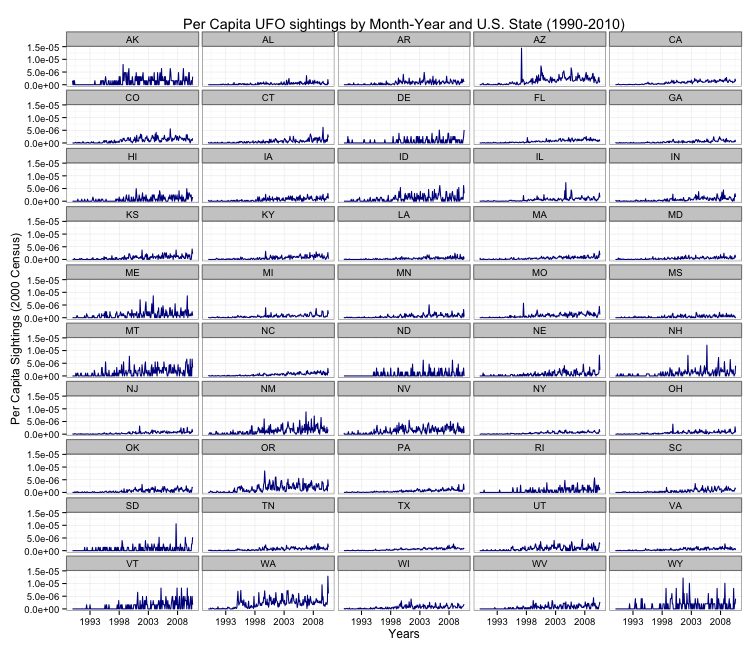
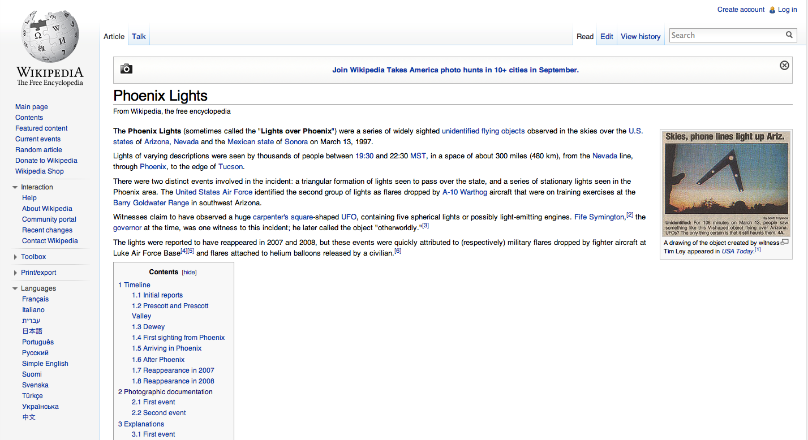

---

# Machine Learning for Hackers

 - John Myles White, Department of Psychology, Princeton University
 - Drew Conway, Department of Politics, New York University

---

### The R programming language

> *The best thing about R is that it was developed by statisticians. The worst thing about R is that...it was developed by statisticians.*

> ~ Bo Cowgill, Google

Pros

 - *lingua franca* of scientific computing
 - Easy prototyping
 

Cons

 - Odd syntax
 - Slow, not for production

---

### What data will we use?

60,000+ Documented UFO Sightings With Text Descriptions And Metadata

http://www.infochimps.com/datasets/60000-documented-ufo-sightings-with-text-descriptions-and-metada

---

### What question will we explore?
 

What, if any, variation is there in UFO sightings across the United States over time?

 - Working with dates
 - Workings with locations
 - Time-series

---

### Taxonomy of Data Science

OWESOM

 - Obtain
 - Scrub
 - Explore
 - Model
 - iNterpret
 
Pronounced "awesome"

"*A Taxonomy of Data Science*," by Hilary Mason and Chris Wiggins

http://www.dataists.com/2010/09/a-taxonomy-of-data-science/ 

---

### What we will cover with the UFO data

 - 
Obtain

   - taken care of by Infochimps.com
 - 
Scrub

   - Load, clean and aggregate
 - 
Explore

   - Summary statistics and visualization
 - Model
 - iNterpret
 
---

### Loading the libraries

    library(ggplot2)
    library(plyr)
    library(scales)

 
 - `ggplot2` for all of our visualizations
 - `plyr` for data manipulation
 - `scales` to fix date formats in plots

---

### Load and inspect the data

    ufo <- read.delim(file.path("data", "ufo", "ufo_awesome.tsv"), sep = "\t", stringsAsFactors = FALSE, 
        header = FALSE, na.strings = "")
    # stringsAsFactors = FALSE

The data file does not come with column labels, but from the notebook we know what they are

    names(ufo) <- c("DateOccurred", "DateReported", "Location", "ShortDescription", 
        "Duration", "LongDescription")
    
    head(ufo, 4)

    ##   DateOccurred DateReported       Location ShortDescription Duration
    ## 1     19951009     19951009  Iowa City, IA             <NA>     <NA>
    ## 2     19951010     19951011  Milwaukee, WI             <NA>   2 min.
    ## 3     19950101     19950103    Shelton, WA             <NA>     <NA>
    ## 4     19950510     19950510   Columbia, MO             <NA>   2 min.
    ##                                                                                                                                                                           LongDescription
    ## 1                                          Man repts. witnessing &quot;flash, followed by a classic UFO, w/ a tailfin at back.&quot; Red color on top half of tailfin. Became triangular.
    ## 2                                                       Man  on Hwy 43 SW of Milwaukee sees large, bright blue light streak by his car, descend, turn, cross road ahead, strobe. Bizarre!
    ## 3 Telephoned Report:CA woman visiting daughter witness discs and triangular ships over Squaxin Island in Puget Sound. Dramatic.  Written report, with illustrations, submitted to NUFORC.
    ## 4                                                    Man repts. son&apos;s bizarre sighting of small humanoid creature in back yard.  Reptd. in Acteon Journal, St. Louis UFO newsletter.

---

### Time to scrub the date strings

To work with the dates, we will need to convert the 'YYYYMMDD' string to an R `Date` type, but something has gone wrong with the data.

    as.Date(ufo$DateOccurred, format = "%Y%m%d")

    ## Error: input string is too long

We know that the date strings are always 8 characters long, so to fix this we identify the bad rows based on the length of the elements.

    good.rows <- ifelse(nchar(ufo$DateOccurred) != 8 | nchar(ufo$DateReported) != 
        8, FALSE, TRUE)
    length(which(!good.rows))

    ## [1] 731

So, we extract only those rows that match our 8 character length criteria

    ufo <- ufo[good.rows, ]

---

### Convert date strings

We replace the strings with R `Date` objects, so we can treat this data as a time-series

    ufo$DateOccurred <- as.Date(ufo$DateOccurred, format = "%Y%m%d")
    ufo$DateReported <- as.Date(ufo$DateReported, format = "%Y%m%d")

We can now use the `summary` function to inspect the date range

    summary(ufo[, c("DateOccurred", "DateReported")])

    ##   DateOccurred         DateReported       
    ##  Min.   :1400-06-30   Min.   :1905-06-23  
    ##  1st Qu.:1999-09-15   1st Qu.:2002-05-20  
    ##  Median :2003-12-15   Median :2005-03-02  
    ##  Mean   :2001-02-10   Mean   :2004-11-28  
    ##  3rd Qu.:2007-06-21   3rd Qu.:2007-12-25  
    ##  Max.   :2010-08-30   Max.   :2010-08-30

---

### Creating new columns from data

It will be useful to create separate columns for both town and state from the Location column

    get.location <- function(l) {
        split.location <- tryCatch(strsplit(l, ",")[[1]], error = function(e) return(c(NA, 
            NA)))
        clean.location <- gsub("^ ", "", split.location)
        if (length(clean.location) > 2) {
            return(c(NA, NA))
        } else {
            return(clean.location)
        }
    }
    # error = function(e) return(c(NA, NA)))

 
Apply this function across `Location` vector

    city.state <- lapply(ufo$Location, get.location)
    location.matrix <- do.call(rbind, city.state)

Add the new `USCity` and `USState` columns to the data frame

    ufo <- transform(ufo, USCity = location.matrix[, 1], USState = location.matrix[, 
        2], stringsAsFactors = FALSE)

---

### Final bit of cleaning

We need to insert the `NA` value for those rows that are not from the United States.  We use the `match` function to identify them. Then, extract that that are from U.S. states by looking for those rows that are not `NA`.

    ufo$USState <- state.abb[match(ufo$USState, state.abb)]
    
    ufo.us <- subset(ufo, !is.na(USState))

We can now see what states have the most reported sightings

    tail(table(ufo$USState)[order(table(ufo$USState))])

    ## 
    ##   AZ   NY   FL   TX   WA   CA 
    ## 2077 2391 2810 2995 3302 7503

---

### Quick visualization

Since the range of the data is so big, let's make a quick and dirty histogram to see what the distribution of sightings is overtime at 50 year intervals.

    quick.hist <- ggplot(ufo.us, aes(x = DateOccurred))
    quick.hist <- quick.hist + geom_histogram()
    quick.hist <- quick.hist + scale_x_date(breaks = "50 years")

---

### First histogram of data

    ## stat_bin: binwidth defaulted to range/30. Use 'binwidth = x' to adjust
    ## this.

---

### Reduce the window, and clean up

The data is heavily skewed to the right, so let's change the time window to those sightings that happen from 1990 on.  To do this, we'll create another version of the data set called `ufo.us`.

    ufo.us <- subset(ufo.us, DateOccurred >= as.Date("1990-01-01"))

For this plot, we'll also make it slightly easier to read by adding borders to the histogram bars.

    new.hist <- ggplot(ufo.us, aes(x = DateOccurred))
    new.hist <- new.hist + geom_histogram(aes(fill = "white", color = "red"))
    new.hist <- new.hist + scale_fill_manual(values = c(white = "white"), guide = "none")
    new.hist <- new.hist + scale_color_manual(values = c(red = "red"), guide = "none")
    new.hist <- new.hist + scale_x_date(breaks = "50 years")

---

### Distribution of sightings from 1990 on

    ## stat_bin: binwidth defaulted to range/30. Use 'binwidth = x' to adjust
    ## this.

---

### Aggregating the data

Time can be aggregated at many different levels

    print(ufo.us$DateOccurred[1])

    ## [1] "1995-10-09"

We need to refine our question:
 
> What, if any, *monthly* variation is there in UFO sightings across the United States?

We use the `ddply` function in the `plyr` package to count the number of sightings for each (Month, Year, State) combination.

The `plyr` package provides functions for splitting data, applying a function over that chunk, and then combining it back together.  A "map-reduce" framework inside of R.

"The Split-Apply-Combine Strategy for Data Analysis," Hadley Wickham, *Journal of Statistical Software*. April 2011, Volume 40, Issue 1. http://www.jstatsoft.org/v40/i01/paper

---

### Counting monthly UFO sightings by State

Create a new column in `ufo.us` with Month-Year for each sighting.  Then, split the data for `(YearMonth, USState)`, and combine using `nrow` to get the number of sightings in each state for every Year-Month occurring in the data.

    ufo.us$YearMonth <- strftime(ufo.us$DateOccurred, format = "%Y-%m")
    sightings.counts <- ddply(ufo.us, .(USState, YearMonth), nrow)
    head(sightings.counts)

    ##   USState YearMonth V1
    ## 1      AK   1990-01  1
    ## 2      AK   1990-03  1
    ## 3      AK   1990-05  1
    ## 4      AK   1993-11  1
    ## 5      AK   1994-11  1
    ## 6      AK   1995-01  1

There are several Year-Month and state combinations for which there are no sightings.  We need to fill those in as zero.

    date.range <- seq.Date(from = as.Date(min(ufo.us$DateOccurred)), to = as.Date(max(ufo.us$DateOccurred)), 
        by = "month")
    date.strings <- strftime(date.range, "%Y-%m")

---

### Filling in the missing data with zeros

    states.dates <- lapply(state.abb, function(s) cbind(s, date.strings))
    states.dates <- data.frame(do.call(rbind, states.dates), stringsAsFactors = FALSE)
    
    all.sightings <- merge(states.dates, sightings.counts, by.x = c("s", "date.strings"), 
        by.y = c("USState", "YearMonth"), all = TRUE)

Now, add some column names that make sense, and convert the NA values to zeroes.

    names(all.sightings) <- c("State", "YearMonth", "Sightings")
    all.sightings$Sightings[is.na(all.sightings$Sightings)] <- 0
    head(all.sightings)

    ##   State YearMonth Sightings
    ## 1    AK   1990-01         1
    ## 2    AK   1990-02         0
    ## 3    AK   1990-03         1
    ## 4    AK   1990-04         0
    ## 5    AK   1990-05         1
    ## 6    AK   1990-06         0

Final bit of house cleaning...

    all.sightings$YearMonth <- as.Date(rep(date.range, length(state.abb)))
    all.sightings$State <- as.factor(all.sightings$State)

---

### Inspect the final data set

    summary(all.sightings)

    ##      State         YearMonth            Sightings    
    ##  AK     :  248   Min.   :1990-01-01   Min.   : 0.00  
    ##  AL     :  248   1st Qu.:1995-02-22   1st Qu.: 0.00  
    ##  AR     :  248   Median :2000-04-16   Median : 1.00  
    ##  AZ     :  248   Mean   :2000-04-16   Mean   : 3.74  
    ##  CA     :  248   3rd Qu.:2005-06-08   3rd Qu.: 4.00  
    ##  CO     :  248   Max.   :2010-08-01   Max.   :97.00  
    ##  (Other):10912

To explore our question we will create a faceted time-series plot to show monthly variation across all fifty states.

---

### Faceted plot

We will create a 5x10 gridded series of plots to show the number of UFO sightings in all 50 states over the 20 year span in our data.

    state.plot <- ggplot(all.sightings, aes(x = YearMonth, y = Sightings))
    state.plot <- state.plot + geom_line(aes(color = "darkblue"))
    state.plot <- state.plot + facet_wrap(~State, nrow = 10, ncol = 5)
    state.plot <- state.plot + theme_bw()
    state.plot <- state.plot + scale_color_manual(values = c(darkblue = "darkblue"), 
        guide = "none")
    state.plot <- state.plot + scale_x_date(breaks = "5 years", labels = date_format("%Y"))
    # scale_x_date(breaks = '5 years', labels = date_format('%Y'))
    state.plot <- state.plot + xlab("Years")
    state.plot <- state.plot + ylab("Number of Sightings")
    state.plot <- state.plot + ggtitle("Number of UFO sightings by Month-Year and U.S. State (1990-2010)")
    # ggtitle('Number of UFO sightings by Month-Year and U.S. State
    # (1990-2010)')

---

---

# What did you notice?

---

### How can we make the visualization better?

We are showing raw counts, but state sizes and populations vary wildly.  We not really comparing "apples to apples" by looking at raw counts.

Let's redraw the graph using per-capita counts to see if it is anymore revealing.

    state.pop <- read.csv(file.path("data/census.csv"), stringsAsFactors = FALSE)
    head(state.pop)

    ##          State    X2011    X2012    X2000
    ## 1   California 37691912 37253956 33871648
    ## 2        Texas 25674681 25145561 20851820
    ## 3     New York 19465197 19378102 18976457
    ## 4      Florida 19057542 18801310 15982378
    ## 5     Illinois 12869257 12830632 12419293
    ## 6 Pennsylvania 12742886 12702379 12281054

---

### Merging data

First we need to convert the state names to abbreviations so they match our current data.  We'll use a simple regex and `grep`.

    state.pop$abbs <- sapply(state.pop$State, function(x) state.abb[grep(paste("^", 
        x, sep = ""), state.name)])

Then, we'll create a new column in `all.sightings` that contains the per capita number of sightings for every row in our data.

    all.sightings$Sightings.Norm <- sapply(1:nrow(all.sightings), function(i) all.sightings$Sightings[i]/state.pop$X2000[which(state.pop$abbs == 
        all.sightings$State[i])])
    
    head(all.sightings)

    ##   State  YearMonth Sightings Sightings.Norm
    ## 1    AK 1990-01-01         1      1.595e-06
    ## 2    AK 1990-02-01         0      0.000e+00
    ## 3    AK 1990-03-01         1      1.595e-06
    ## 4    AK 1990-04-01         0      0.000e+00
    ## 5    AK 1990-05-01         1      1.595e-06
    ## 6    AK 1990-06-01         0      0.000e+00

---

### Slightly change the visualization

    state.plot.norm <- ggplot(all.sightings, aes(x = YearMonth, y = Sightings.Norm))
    state.plot.norm <- state.plot.norm + geom_line(aes(color = "darkblue"))
    state.plot.norm <- state.plot.norm + facet_wrap(~State, nrow = 10, ncol = 5)
    state.plot.norm <- state.plot.norm + theme_bw()
    state.plot.norm <- state.plot.norm + scale_color_manual(values = c(darkblue = "darkblue"), 
        guide = "none")
    state.plot.norm <- state.plot.norm + scale_x_date(breaks = "5 years", labels = date_format("%Y"))
    state.plot.norm <- state.plot.norm + xlab("Years")
    state.plot.norm <- state.plot.norm + ylab("Per Capita Sightings (2000 Census)")
    state.plot.norm <- state.plot.norm + ggtitle("Per Capita UFO sightings by Month-Year and U.S. State (1990-2010)")

We just replace the data being mapped to the y-axis with the new `Sightings.Norm` column, and update our labels accordingly.

---

---

# What happened in AZ in the mid-90's?

---

If you Google "arizona ufo" it auto-suggests "arizona ufo 1997"...

> ...a series of widely sighted unidentified flying objects observed in the skies over the U.S. states of Arizona, Nevada and the Mexican state of Sonora on March 13, 1997.
